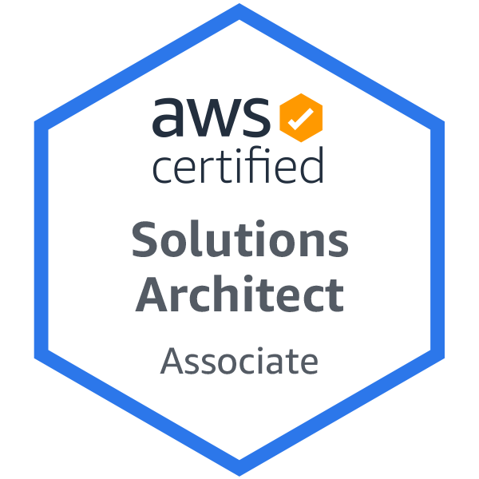
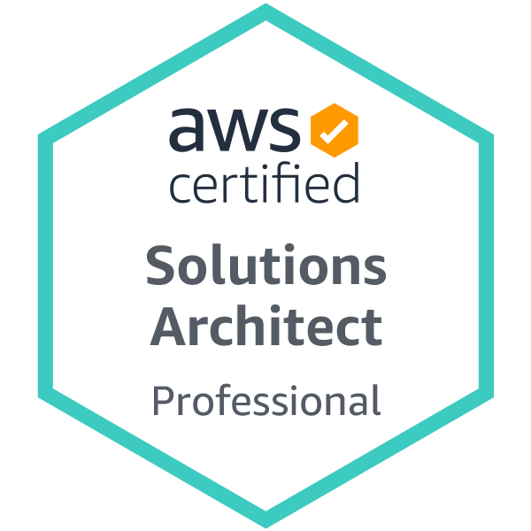

+++
title = "About"
layout = "about"
+++

# 自己紹介

クラウドエンジニア、香川県出身の２７歳です。

普段はブログ書いたり、勉強会を開いたりしております。

コーヒーが大好きで豆を挽くところから、フィルターやフレンチプレス、マキネッタなど気分で飲み分けてます。

前職はフリーで通信端末販売のプレイングマネージャーをしておりました。

---

# スキル

## 【実務】
<!-- バッヂはここから　https://shields.io -->
![![AzureAD]](https://img.shields.io/static/v1?label=&message=AzureAD&color=blue&style=for-the-badge&logo=microsoftazure)
![![Intune]](https://img.shields.io/static/v1?label=&message=Intune&color=blueviolet&style=for-the-badge&logo=springsecurity&logoColor=white)
![![AWS]](https://img.shields.io/static/v1?label=&message=AWS&color=black&style=for-the-badge&logo=amazonaws&logoColor=orange)

## 【独学】

---
# 略歴

| 年数 | 学歴・職歴 |
| --  | -- |
| '20/10 ~ 現在 | SES企業に入社、現在に至る |
| '20/4 ~ '20/9 | DMMWEBCAMPと独学 |
| '20/2 ~ '20/3 | 上京し、業務委託で動画作成 |
| '19/10 ~ '20/1 | 業務委託で通信端末販売のプレイングマネージャー |
| '17/4 ~ '19/10 | 家電量販店での通信端末販売員 |
| '13/4 ~ '17/3　| 岡山理科大学理学部科学科卒 |

※ 社名などは伏せております。