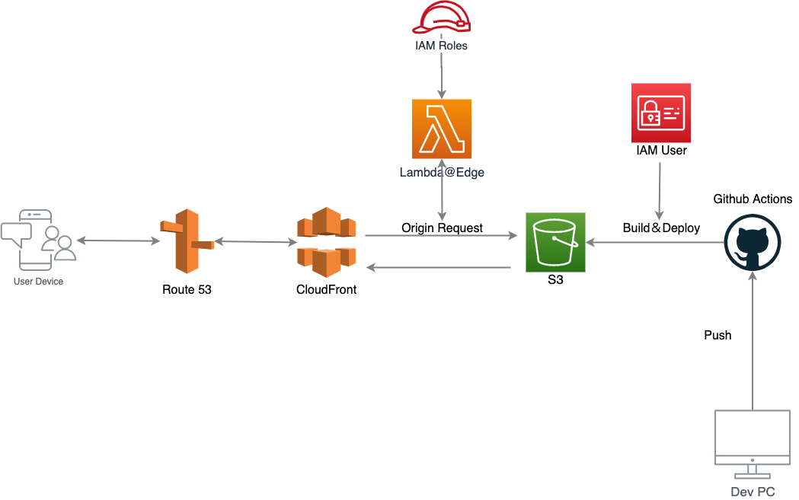

+++
title = "このサイトの構成について"
date  = 2022-03-04
tags  = ["s3","CloudFront","github","Lambda"]
categories = ["Tech"]
aliases = ["blog/2/"]
image = "image.png"
+++

# やってみた1回目
## 目的
* 手を動かしてテックブログを作る
* 記事の投稿でGithubの草を生やす
* 備忘録として残す
* 誰かの助けになるといいなあ（）
* あと、EC2にサイトを立てるとキーが漏れたときにコインマイニングされてクラウドﾀﾋしそうだなって、、

---

## 構成
* S3+CloudFrontの静的サイトホスティング
* Hugoで静的サイトを作成




---
## 1. GitHub Actionsにて下記のコードをもとにビルドし、デプロイまで行う。
```yaml
name: S3 Upload

# on はイベントトリガー。発火条件がmainブランチにプッシュすること。
on:
  push:
    branches:
      - develop

# jobs は実行させる作業を定義。
# build は作業の実行環境を定義。
# step は実行する各作業内容を定義。
jobs:
  build:
    runs-on: ubuntu-latest
    timeout-minutes: 5

    steps:
      - name: Checkout
        uses: actions/checkout@v2
        with:
          # Fetch Hugo themes (true OR recursive)
          submodules: true
          # Fetch all history for .GitInfo and .Lastmod
          fetch-depth: 0

      - name: Setup Hugo
        uses: peaceiris/actions-hugo@v2
        with:
          hugo-version: "latest"
          # extended はHugoのextendedバージョンを使うことを意味する。
          extended: true

      - name: Build Hugo
        run: |
          hugo --environment production

      - name: Configure AWS credentials
        uses: aws-actions/configure-aws-credentials@v1
        with:
          aws-access-key-id: ${{ secrets.AWS_S3_ACCESS_KEY_ID }}
          aws-secret-access-key: ${{ secrets.AWS_S3_SECRET_ACCESS_KEY }}
          aws-region: ap-northeast-1

# 変更前のファイル群を削除し、build してできたpublic内のファイル群をコピー。
      - name: Upload file to S3
        env:
          S3_UPLOAD_BUCKET: ${{ secrets.S3_UPLOAD_BUCKET }}
        run: |
          aws s3 sync --exact-timestamps --delete ./public/ $S3_UPLOAD_BUCKET/

```
※ シークレットキーは予めGithub上にアップロードしておきましょう。

※ システムに利用するIAMユーザーの作成の際はホワイトリスト形式でのIAMポリシーの作成をお勧めします。

参考サイト

[[GitHub Actions] AWS S3へファイルを自動的に転送する](https://blog.katsubemakito.net/git/actions-awss3)

[Github Actionsを使って、HugoサイトをS3にデプロイする方法](https://note.com/yiio/n/n246f58a71c1e)

---
## 2. アップロードしたファイル群をCloudFrontを用いて配信する。

1. S3とCloudFrontを関連づけます。
2. S3のバケットポリシーを更新します。（特にいじらなければOAIを構成する際に自動更新とすると勝手に更新されます）
3. ACMを用いて証明書をインストールしてHTTPS化します。
4. Route53を用いて独自ドメインからルーティングします。（お名前.comなどでドメインを取得している場合は移管するかカスタムドメインの登録をしましょう）

※ OAIについて、特別なCloudFrontユーザーをS3バケットと関連付けすることでCloudFront経由でしかS3バケットの閲覧ができないように制限できます。つまり、S3の静的ホスティング機能を使わなくてすみます！えらい！！

参考サイト

[AWS Hands-on for Beginners　AWS 上で静的な Web サイトを公開しよう！](https://pages.awscloud.com/JAPAN-event-OE-Hands-on-for-Beginners-StaticWebsiteHosting-2020-reg-event-LP.html?trk=aws_introduction_page)

※ Hands-on for Beginnersではフォームでの申し込みが必要です。ものすごく丁寧なのでぜひ。

[オリジンアクセスアイデンティティ (OAI) を使用して Amazon S3 コンテンツへのアクセスを制限する](https://docs.aws.amazon.com/ja_jp/AmazonCloudFront/latest/DeveloperGuide/private-content-restricting-access-to-s3.html)

---

## 3. サブディレクトリのindex.htmlへのルーティングをLambda@Edgeで行う。

S3とCloudFrontを関連づけることで下記のタイミングでLambda関数を動かすことができます。
* ビューアーリクエスト
* ビューアーレスポンス
* オリジンリクエスト
* オリジンレスポンス

1. リージョンをus-east-1に切り替えます。
2. Lambdaを開き、下記のコードを関数を作成します。
```js
'use strict';
exports.handler = (event, context, callback) => {
    const request = event.Records[0].cf.request;

    const olduri = request.uri;

    // 末尾が/で終わっている場合はindex.htmlを付与してリクエスト
    const newuri = olduri.replace(/\/$/, '\/index.html');

    // S3へのリクエストのURLを差し替える
    request.uri = newuri;

    return callback(null, request);
};
```
3. 信頼ポリシーにLambdaを追加します。
4. トリガーにCloudFrontのオリジンリクエストを設定します。

参考サイト

[CloudFront+S3構成でサブディレクトリのIndexを参照する方法！😎CloudFrontとLambda@Edgeのテクニックを解説🚀](https://www.ragate.co.jp/blog/articles/5446)

[[AWS] CloudFrontでBASIC認証を行う – Lambda@Edge + Node.js](https://blog.katsubemakito.net/aws/cloudfront-basicauth)

※こちらのサイトは信頼ポリシーの追加に関して参考にさせていただきました。

[関数を使用してエッジでカスタマイズ](https://docs.aws.amazon.com/ja_jp/AmazonCloudFront/latest/DeveloperGuide/edge-functions.html)

---

# 完走した感想

これでGitHubへプッシュしたらビルドしてアップロードまでしてくれるようにパイプラインの構築ができました。

正直なところ、ググってコピペなところも多かったので至らない点が多々あります。しかし多くのブログのおかげで形にすることができたので自分も分かりにくいのは承知の上でとにかく書くことにしました。

この場で多くのブログ著書様方に深くお礼申し上げます。

