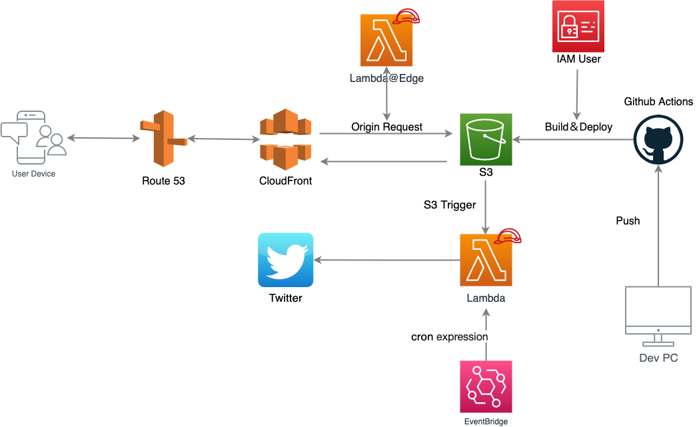
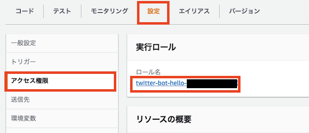
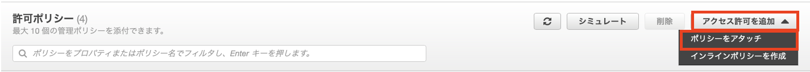
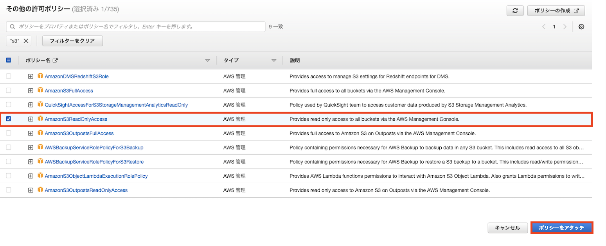
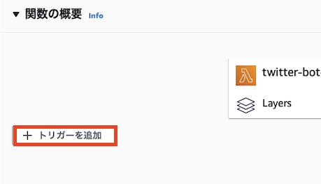
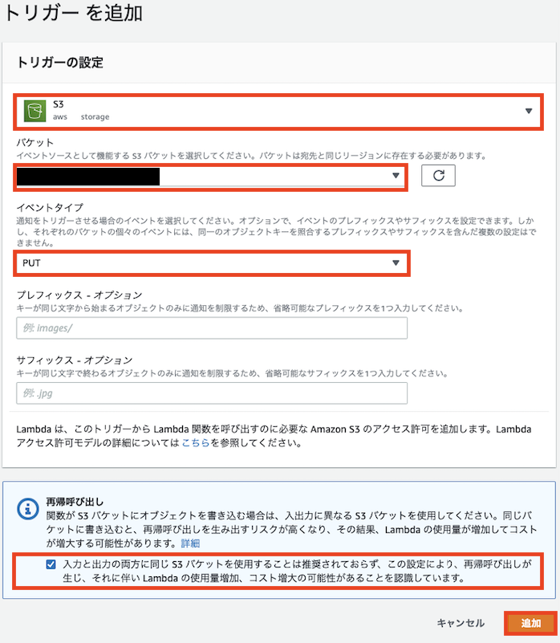

+++
title = "ツイッターbotでブログ投稿をお知らせしてくれるようにしてみた"
date  = 2022-03-16
tags  = ["Twitter","s3","Lambda"]
categories = ["Tech"]
image = "image.png"
+++

# やってみた2回目

## 目的
* TwitterBotで何か作ってみたい！！
* 同じようなことを考える人の参考用に残す！
* 前回よりもわかりやすく記事を書く！！！
* 守破離という考え方にバリバリ共感したので真似てみる→応用してみるという風に進めてみる。

---

## 構成
* 前回の構成をもとにS3トリガーを使って記事のアップデートされた際にLambdaを動かしてみる。
* ついでに決められた日時にも動くようにEventBridgeにルールを書く。



## ①実践したハンズオン

なんと無料でTwitter Bot作成までハンズオンで学べます！！！！2022年3月16日現在で全3回まであります。全て、やろう！

[お役立ち Twitter Bot を作りながら学ぶ AWS ドリル~第 1 回 おはよう Bot 編](https://aws.amazon.com/jp/builders-flash/202201/aws-drill-twitter-bot-1/?awsf.filter-name=*all)

著者 [@ketancho](https://twitter.com/ketancho) さん

---

## ②作成したコードを元に構成図を目指して構築する

```python
import json
import os
import boto3
from requests_oauthlib import OAuth1Session
from datetime import datetime, timedelta, timezone

#### 変数 ####
# aws リソースの呼び出し
ssm_client = boto3.client('ssm')
s3 = boto3.resource('s3') # 追加
# USTを日本時間に変換
JST = timezone(timedelta(hours=+9), 'JST')
# OAuth1.0a に必要な情報を格納する変数
oauth = None

#### 定数 ####
BUCKET_NAME = 'team-kss.net' # 追加
OBJECT_KEY_NAME = 'search/index.json' # 追加

#### 関数 ####
def lambda_handler(event, context): 
    init()
    # s3からhugoによってビルドされたindex.jsonを取得して整形する関数を定義して追加する
    blog_index = get_s3obj(BUCKET_NAME, OBJECT_KEY_NAME)
    now = datetime.now(JST).strftime("%Y年%-m月%-d日")
    text = now + 'の更新です。' + 'タイトルは「' + blog_index[0]['title'] + '」です！' + 'リンクはこちら→ ' + blog_index[0]['permalink']  # 変更
    tweet(text)


def init():
    ### ここのコードはハンズオンをぜひやってみて書いてください！！ ###

 # ここから
def get_s3obj(bucket_name, obj_key):
    bucket = s3.Bucket(bucket_name)
    obj = bucket.Object(obj_key)
    response = obj.get()
    body = response['Body'].read()
    return json.loads(body.decode('utf-8'))
# ここまで追加

def tweet(text):
    ### ここのコードはハンズオンをぜひやってみて書いてください！！ ###
```

1. 今回はS3バケットにビルドしたファイルの一部を取得してツイートの内容に含めたいため、boto3を利用してs3の呼び出しをできるようにする。
2. get_s3obj関数を新規で定義して、OBJECT_KEY_NAME定数で指定したJsonファイルを呼び出してjson形式に整形する。
3. 取得したデータは下記のような要素で構成されているため、必要な要素を取得する。
   ```json
   [{"content":"Hello World","date":"2022-02-28T00:00:00Z","image":"test.jpg","permalink":"https://...","title":"Hello!!"},{...}]
   ```
4. 取得したデータを組み合わせてテキストを作成する。

【参考サイト】

[boto3 Docs 1.21.19 documentation ~S3.Object.get](https://boto3.amazonaws.com/v1/documentation/api/latest/reference/services/s3.html#S3.Object.get)

[AWS LambdaのPythonでS3のファイルを取得する](https://dev.classmethod.jp/articles/get-s3-object-with-python-in-lambda/)

[Python の Lambda 関数ハンドラー](https://docs.aws.amazon.com/ja_jp/lambda/latest/dg/python-handler.html)

---

## ③実行ポリシーを追加する
1. Lambda関数の画面から[設定]>[アクセス許可]>[実行ロール]の順にアクセスする。

2. [アクセス許可の追加]>[ポリシーのアタッチ]の順にアクセスする。

3. [AmazonS3ReadOnlyAccess]を検索し、[ポリシーをアタッチ]をクリックする。


---

## ④トリガーにs3トリガーを追加する
1. Lambda関数の画面から[トリガーを追加]をクリックする。

2. トリガーに[s3]を選択し、今回は更新のみをトリガーにしたいので[PUT]を選ぶ。再帰呼び出しについてはLambda関数にGetアクションとListアクションのみを許可しているためチェックをいれて[追加]をクリックする


---

## 完走した感想

プログラミングって物作りしてなんぼだと実感。AWSには質の良いハンズオンが多いので実践して応用するということを今後も続けていくつもり。

次の案としてはRDB Proxy経由でツイート内容を保存、一定期間記事の更新がなければワシを激詰するBotくんとか、ラズパイ買ってきてAWS環境とVPNを張って擬似ハイブリッド環境の構築とかとか、、他にも良い案あったらTwitterで教えてほしいなあって！！

最後に、ハンズオン並びに参考サイトの著者の皆様に心からの感謝を。そして、微力ながら同じように自分の行動が次の誰かの心を動かせたら幸いです。