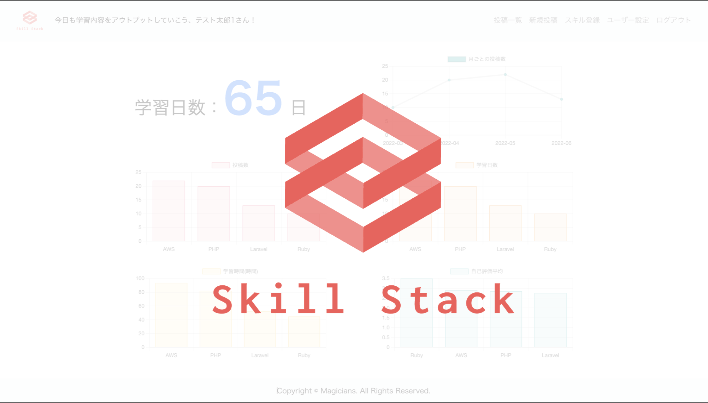
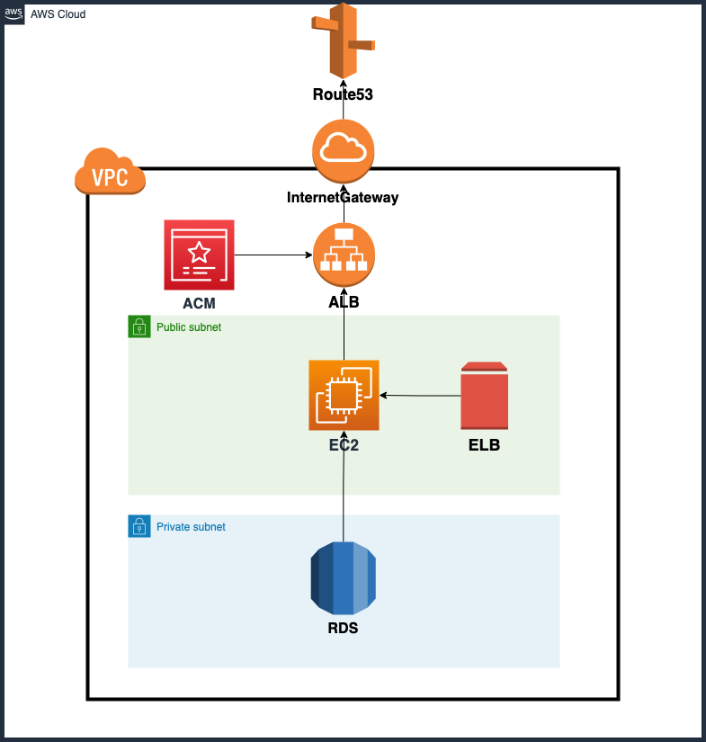
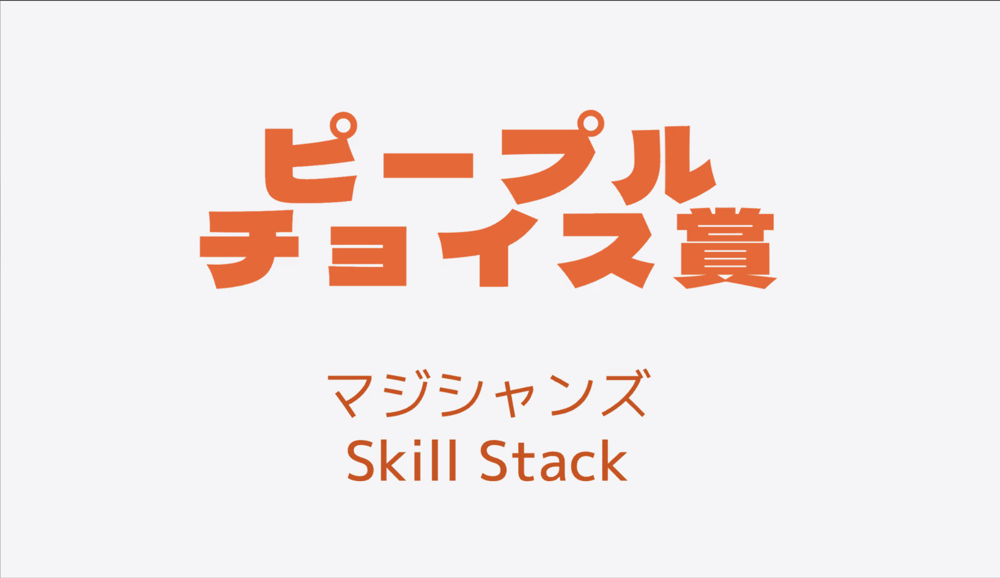

+++
title = "人生3回目のハッカソンは開発の楽しさを学べた"
date  = 2022-03-22
tags  = ["Hackathon","Ruby on Rails"]
categories = ["Event"]
image = "image.png"
+++

# 人生三度目のハッカソンに参加しました。

## 目的
* ### DMMWebCamp主催のハッカソンに参加する機会があったので備忘録として残しておきます。
* ### 過去１度目は開発が終わらず、２度目は人数の都合で応援側にまわり、３度目の正直という気持ちで挑みました。
* ### 主に自分が思い出してニヤつくための記事なので技術的なことは少しだけです。

---

## 企画概要
* ### 24時間でランダム選出された3人1組で「プログラミングを楽しく学ぶWebアプリ」を開発する。
* ### インフラに関しては動作テストまでOK
* ### テーブル定義書、ER図、ワイヤーフレームなどは事前に作成OK
* ### ハッカソンを楽しむこと！

だそうです。正直コードはあまり書かないですが、良い機会なので思い出しつつ進めていきます。

---

## 開発にかける思い

### 1人で学ぶことは辛い時もあります。僕は筋トレが1日できなかっただけで辞めたこともあります。

### どんな小さなことでも目に見える形として残る。削除機能や引き算のない積み上がったものだけが可視化されるツールを作りたいと考えました。

### それが学習可視化ツール、SkillStackです。

### 閉鎖ずみ → [Skill_stack](https://skill_stack.net)

---

## 構成図

### シンプルイズベストと言わんばかりの構成。優秀なチームメンバーがドメインまで取ってくれて良き。

---

## 結果

### 開発が間に合えば御の字と言わんばかりの精神でしたが、まさかまさか賞をいただきました。

### しかも閲覧者が使ってみたいと思った投票第１位という素晴らしい賞をです。

### ライブラリとかバンバン使ってるので人から見れば、こんな簡単なコードで、、、とか思う方もいるかもしれません。

### ですがコーディングを本職としない人から見て使ってみたいと思われたということは何物にも変え難い経験として蓄積されました。

### 今後もこの気持ちを忘れずにエンジニア人生を送っていきたいと思います。

【作成物】

## github はこちら → [Skill_Stack](https://github.com/dmm-magicians/skill_stack)