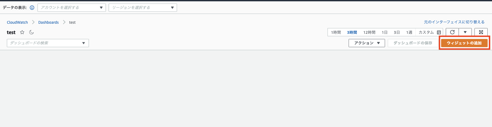
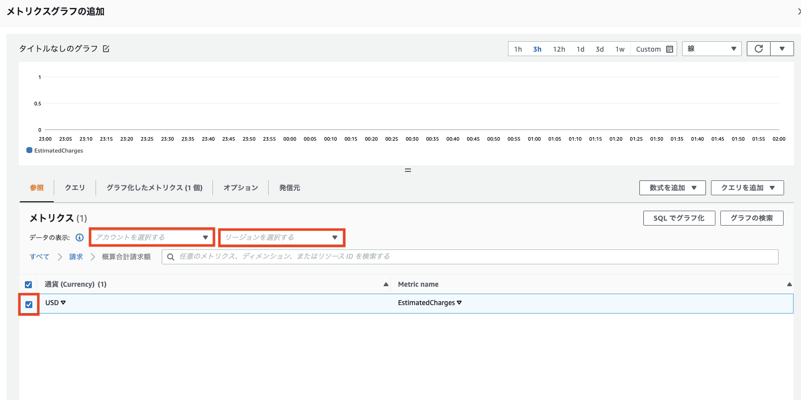

+++
title = "独立したAWSアカウントの請求管理をしたい"
date  = 2022-06-06
tags  = ["インフラ" , "AWS"]
categories = ["Tech"]
image = "image.png"
+++

# Organizationsを使わずに独立した検証用AWSアカウントの請求管理をしたい！

検証用アカウントが乱立してきて、請求管理をしたいがOrganizationsを導入するつもりはない。

企業の中には他社アカウントを利用しているためOrganizationsの利用ができないこともあるだろう。

調べて見たらあまり検索に引っ掛からなかったので手順書を残しておく。

---

# 目的

- 乱立するAWSアカウントの管理
- Organizationsを使わず、独立した検証用AWSアカウントとして利用
- billing&usageレポートの集約

---

# 方法

前提として請求集約用アカウントと検証用アカウントを用意します。

※今回はどちらもルートユーザーです。

1. 検証用アカウントのCloudWatchを開き、請求集約用アカウントのAWSアカウントIDに対してデータ共有を許可する。

    ※この際に必ず検証用アカウントのリージョンをバージニア北部とする。

   - 左ペインのメニューから[設定]を開き、クロスアカウントクロスリージョンの[設定]をクリックする。

   - CloudWatch データを共有の[データを共有]をクリックし、請求集約用アカウントのアカウントIDを入力する。その後、[CloudFormationテンプレートを起動]をクリックする。

   - CFnテンプレートを起動してよいか聞かれるので[確認]と入力して[起動テンプレート]をクリックする。

   - チェックを入れて、[スタックを作成]をクリックする。

   - CloudWatchのクロスアカウントクロスリージョンの画面に戻り、ステータスが[共有済み]となっていることを確認する。

1. 請求集約用アカウントのCloudWatchを開き、クラスアカウントダッシュボードを作成する。
   
   - 左ペインのメニューから[設定]を開き、クロスアカウントクロスリージョンの[設定]をクリックする。

   - クロスアカウントクロスリージョンを表示の[有効化]をクリックする。

   - ダッシュボード作成時にドロップダウンでアカウントを選択できるように["<アカウントID>" "<アカウント名>"]の形で入力する。その後、[有効化]をクリックすることでステータスが有効に変わることを確認。

   - 左ペインからダッシュボードを選択し、[ダッシュボードの作成]をクリックする。

   - ダッシュボード名を決め、[線]-[ウィジェットを追加]からメトリクスを追加する。

   - [アカウントを選択する]から追加したいアカウント名を選択し、[請求]-[概算合計請求額]-[USD]でメトリクスを追加しましょう。

---

# Next Action
- クロスアカウントアラートで全AWSアカウントの請求額を通知するようにするとか
- 下記記事を参考にして、毎月の検証用アカウントのbilling&Usageを請求集約用アカウントのS3バケットに送信するLambdaを作成したりとか

[AWSアカウントを跨いで利用料金を取得する](https://qiita.com/takiguchi-yu/items/565abbcde1dcaaf75d12)

---

# 感想
いちいちアカウントを管理するのも請求管理するのもこれで解決。今んとこ管理してるアカウント2個しか持ってないけど٩( ᐛ )و

---

# 参考文献

[CloudWatchでクロスアカウント、クロスリージョンダッシュボードを作れるようになったのでやってみた](https://dev.classmethod.jp/articles/cross-account-cross-region-dashboards-with-amazon-cloudwatch/)

[[アップデート] CloudWatch でクロスアカウントアラームが使用可能に！](https://dev.classmethod.jp/articles/cloudwatch-cross-account-alarms/)

